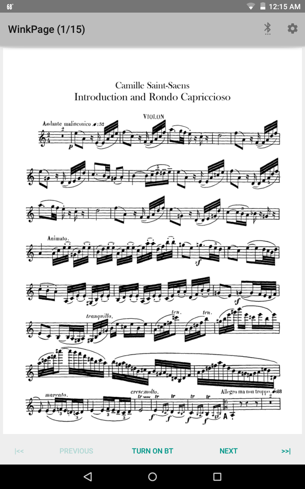

#  WinkPageServer



This repository contains source codes for my graduate directed project "A Hands-Free Music Score Turner Using Google Glass."
This project proposes an innovative use of wearable technology for music performers, 
allowing them to interact with mobile applications that run as a hands-free music score turner 
between Google Glass and a portable device such as a smartphone or a tablet. 
Using wink detection feature and head motion sensing of Google Glass, 
the application enables users to send a trigger without using their hands to turn pages of documents displayed on a nearby mobile device.  
It is intended for music instrument players who need to turn music score sheets during their performance. 


## Installation

To run this application, download WinkPageServer.apk under the root of this repository on your Android phone/tablet device.

## Usage


This application needs to interact with [the client application](https://github.com/satokora/WinkPageGlass) on Google Glass
in order to run as a hands-free music score sheet turner. This project consists of two applications, 
one acts as a client and the other acts as a server. The client application runs on a Google Glass, 
and the server is intended to be used on an Android mobile device. Bluetooth connection needs to be established 
between the two applications. After the connection is established, 
when the client application detects motion and it sends a message that tells which motion is detected to the server application 
via Bluetooth. The server side displays a document as a PDF viewer and turns a page forward or backward of the document 
when a corresponding message is received from the client application.  In addition, the user can upload and download PDF files 
interacting with Google Drive services.

1. Start "WinkPageTurner" from menu screen
2. Tap "Turn on BT" button at the bottom of screen
3. Launch [client application](https://github.com/satokora/WinkPageGlass) On Google Glass, a list of available Bluetooth enabled devices is displayed on the screen. Swipe it and select the device you want to connect,
and tap once to start Bluetooth connection.
4. If you see right/left arrow screen with selected gesture names on Google Glass, you are ready to use the application.
5. When you tap Settings icon at the top-right, you can select and map gestures to page-turning (forward/backward).

## Platform
* Android 5.0.1 API 21

## Development Environment
* IDE: Android Studio
* SDK: Android 5.0.1 API 21 SDK Platform
* Imported Library: [Google Drive Android API](https://developers.google.com/drive/android/)

## Credits

This application is developed by help of the following great resources.
I appreciate all of their great work.
* PDF Viewer: [android-PdfRendererBasic](https://github.com/googlesamples/android-PdfRendererBasic) By [googlesamples](https://github.com/googlesamples)
* Bluetooth socket interaction: [android-BluetoothChat](https://github.com/googlesamples/android-BluetoothChat) By [googleSamples](https://github.com/googlesamples)
* Google Drive file upload/download: [android-demos](https://github.com/googledrive/android-demos) By [googledrive](https://github.com/googledrive)

## License
```
MIT License

Copyright (c) 2016 Satoko Kora

Permission is hereby granted, free of charge, to any person obtaining a copy
of this software and associated documentation files (the "Software"), to deal
in the Software without restriction, including without limitation the rights
to use, copy, modify, merge, publish, distribute, sublicense, and/or sell
copies of the Software, and to permit persons to whom the Software is
furnished to do so, subject to the following conditions:

The above copyright notice and this permission notice shall be included in all
copies or substantial portions of the Software.

THE SOFTWARE IS PROVIDED "AS IS", WITHOUT WARRANTY OF ANY KIND, EXPRESS OR
IMPLIED, INCLUDING BUT NOT LIMITED TO THE WARRANTIES OF MERCHANTABILITY,
FITNESS FOR A PARTICULAR PURPOSE AND NONINFRINGEMENT. IN NO EVENT SHALL THE
AUTHORS OR COPYRIGHT HOLDERS BE LIABLE FOR ANY CLAIM, DAMAGES OR OTHER
LIABILITY, WHETHER IN AN ACTION OF CONTRACT, TORT OR OTHERWISE, ARISING FROM,
OUT OF OR IN CONNECTION WITH THE SOFTWARE OR THE USE OR OTHER DEALINGS IN THE
SOFTWARE.
```
